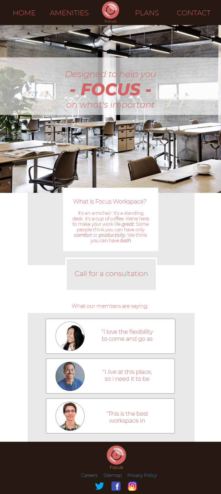

# FOCUS Workspace

A web presence for the workspace company, FOCUS. September 2018

By Ben Kiggen

## Description
This is a 2-week project spanning units 2.2 and 2.3 in Epicodus' User Interfaces class. I was presented with a client's non-technical specs for a website and built a site, attending to each step of the design process. This includes creating profiles and stories for main groups of potential users to guide development, hand sketching the layout, wireframing using Adobe xD, prototyping using the same tool, and finally building the site in html, css (with Sass), and javascript (with jQuery).

##Prerequisites

Node Package Manager

##Setup/Installation Requirements
See it live @ https://bkiggen.github.io/focusworkspace

Download it @ https://github.com/bkiggen/focusworkspace

* Download the .zip file or clone from command line
* Open index.html in your chosen browser and/or IDE

## Screenshots

## Research

I did extensive research into the branding done for workspace companies, with specific attention paid to those in New York City. Something they all had in common was a simple, easy-to-navigate layout. They varied in their design styles but consistent across all of them was a sense of cleanliness and order. They often employed sparse layouts but were typically very aesthetically pleasing. The sites communicated that "this is a clean, stylish space where intelligent professionals do business". Clean lines, sans-serif fonts, and large hero headers.

## Client Specifications

* Online presence must match in-person presence
  * luxurious / high-end
  * comfortable
  * cool, funky, fun, not corporate
  * welcoming / inclusive
  * safe and productive
  * not a "big guy", local, unique
* Online presence communicates that client is not exclusively for tech
  * artists, daytraders, craftspeople, daytraders, writers
* Client's amenities are clearly displayed
  * spaces: coffee counter area, communal workspace, one of our meeting areas, front entrance, front entrance looking out
  * amenities: on-site coffee counter, communal working areas and private offices, high-speed internet, printing/faxing services
  * optional activity on Thursday afternoons: yoga, complimentary food, crafts, etc.
* Site should include:
  * landing page
  * contact page
  * amenities page
  * services page
    * subscription model
    * costs
    * membership
    * how to join

## Technologies Used
_This software was created using HTML, CSS, javascript, and jQuery _

##Support and contact details
For inquiries, issues, or contributions, please contact Ben Kiggen at benkiggen@gmail.com

## License
License: MIT license

## Notes
10am-1pm Friday spent troubleshooting dev environment problems.

Copyright (c) 2018 Ben Kiggen
